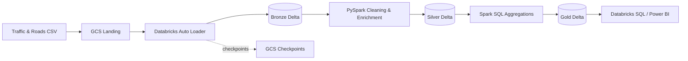

# GCP + Databricks Traffic Data Pipeline

End-to-end Data Engineering project built with **Google Cloud Platform** and **Databricks**.  
The pipeline incrementally ingests traffic files from Google Cloud Storage, applies Bronze/Silver/Gold transformations, creates analytical datasets and validates critical data-quality rules.

## Architecture



## Data flow

### Bronze
Raw CSV files are ingested incrementally from GCS with **Databricks Auto Loader**.

- explicit Spark schemas
- source-file metadata
- ingestion timestamps
- checkpoint-based incremental processing
- Delta tables

### Silver
PySpark transformations create clean, standardized datasets.

Traffic transformations include:

- column-name normalization
- deduplication by `record_id`
- null handling
- date conversion
- electric-vehicle counts
- motor-vehicle counts
- total traffic counts

Road transformations include:

- deduplication by `road_id`
- null handling
- normalized column names

### Gold
Spark SQL builds analytics-ready tables:

- `traffic_volume_by_year`
- `traffic_by_region`
- `road_usage_statistics`
- `ev_adoption_trend`
- `road_network_summary`

## Technology stack

| Area | Technology |
|---|---|
| Cloud | Google Cloud Platform |
| Object storage | Google Cloud Storage |
| Data platform | Databricks on GCP |
| Governance | Unity Catalog |
| Processing | Apache Spark / PySpark |
| SQL | Spark SQL / Databricks SQL |
| Storage format | Delta Lake |
| Incremental ingestion | Databricks Auto Loader |
| Orchestration | Databricks Workflows / Asset Bundles |
| Version control | Git / GitHub |
| CI | GitHub Actions |

## Repository structure

```text
.
├── .github/
│   └── workflows/
│       └── python-syntax.yml
├── docs/
│   └── gcp_databricks_setup.md
├── notebooks/
│   ├── 01_setup/
│   │   └── setup_catalog.py
│   ├── 02_bronze/
│   │   ├── ingest_traffic.py
│   │   └── ingest_roads.py
│   ├── 03_silver/
│   │   ├── transform_traffic.py
│   │   └── transform_roads.py
│   ├── 04_gold/
│   │   └── gold_transformations.sql
│   └── 05_validation/
│       └── validate_pipeline.py
├── sample_data/
│   └── README.md
├── sql/
│   ├── analytics_queries.sql
│   └── data_quality_checks.sql
├── workflows/
│   └── traffic_etl_job.yml
├── databricks.yml
├── .gitignore
└── README.md
```

## Environments

The code supports three environments with the same notebooks:

```text
dev  -> dev_catalog
uat  -> uat_catalog
prd  -> prd_catalog
```

Each Databricks task receives an `env` parameter. Infrastructure such as GCS External Locations is environment-specific, while transformation code stays reusable.

Recommended Git flow:

```text
dev branch -> uat branch -> main (production)
```

## GCS layout

```text
gs://<bucket>/
├── landing/
│   ├── raw_traffic/
│   └── raw_roads/
├── checkpoints/
└── medallion/
    ├── bronze/
    ├── silver/
    └── gold/
```

The notebooks expect Unity Catalog External Locations named:

```text
landing_<env>
checkpoints_<env>
bronze_<env>
silver_<env>
gold_<env>
```

For example: `landing_dev` and `checkpoints_dev`.

## Pipeline workflow

```text
setup_catalog
      |
      +------------------+
      |                  |
ingest_traffic      ingest_roads
      |                  |
silver_traffic      silver_roads
      |                  |
      +---------+--------+
                |
              gold
                |
        validate_pipeline
```

The workflow definition is available in [workflows/traffic_etl_job.yml](workflows/traffic_etl_job.yml).

## Data quality

The project includes both exploratory SQL checks and job-blocking validation.

Examples:

- duplicate business keys
- null required keys
- negative vehicle counts
- reconciliation of derived totals
- non-empty Gold tables

See:

- [sql/data_quality_checks.sql](sql/data_quality_checks.sql)
- [notebooks/05_validation/validate_pipeline.py](notebooks/05_validation/validate_pipeline.py)

## Running the project

### 1. Prepare GCP and Databricks

Follow [docs/gcp_databricks_setup.md](docs/gcp_databricks_setup.md).

### 2. Upload input data

Traffic files:

```text
gs://<bucket>/landing/raw_traffic/
```

Road files:

```text
gs://<bucket>/landing/raw_roads/
```

### 3. Run manually

Run in order with `env=dev`:

1. `setup_catalog.py`
2. `ingest_traffic.py`
3. `ingest_roads.py`
4. `transform_traffic.py`
5. `transform_roads.py`
6. `gold_transformations.sql`
7. `validate_pipeline.py`

### 4. Run as a Databricks workflow

The repository includes a Databricks Asset Bundle configuration:

```bash
databricks bundle validate -t dev
databricks bundle deploy -t dev
databricks bundle run traffic_etl -t dev
```

The commands require a configured Databricks CLI profile and workspace permissions.

## CI/CD

GitHub Actions performs a Python syntax check on pushes and pull requests.

The project is designed for code promotion:

```text
DEV -> UAT -> PRD
```

A production implementation can additionally configure Databricks authentication in GitHub Actions and automatically deploy bundles after approved pull requests.

## Security

Secrets and credentials must never be committed to Git.

The repository ignores common secret files such as:

- `.env`
- service-account JSON files
- private keys
- local Databricks configuration

Use GCP IAM, Unity Catalog Storage Credentials and secret-management mechanisms instead.

## Project goals

This project demonstrates:

- cloud data-lake ingestion
- incremental file processing
- Medallion Architecture
- Delta Lake
- PySpark transformations
- SQL analytics modeling
- data-quality controls
- workflow orchestration
- environment parameterization
- Git-based development
- basic CI/CD

## Acknowledgement

This portfolio implementation is inspired by the public **gcp-dbx-traffic** learning project by `shaikgcppractice-coder`.  
The repository structure, code organization, SQL-oriented Gold layer, validation and CI setup in this version were rebuilt for this portfolio project.

## Status

🚧 Infrastructure execution on GCP / Databricks still needs to be configured and tested with the target workspace and bucket.
